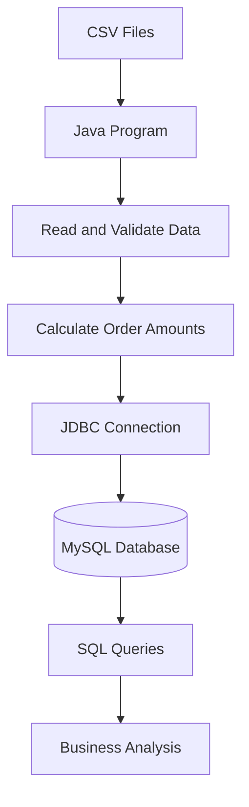

## Architecture / Flowchart

```mermaid
flowchart TD
    A[CSV Files] --> B[Java Program]
    B --> C[Read and Validate Data]
    C --> D[Calculate Order Amounts]
    D --> E[JDBC Connection]
    E --> F[(MySQL Database)]
    F --> G[SQL Queries]
    G --> H[Business Analysis]
```
